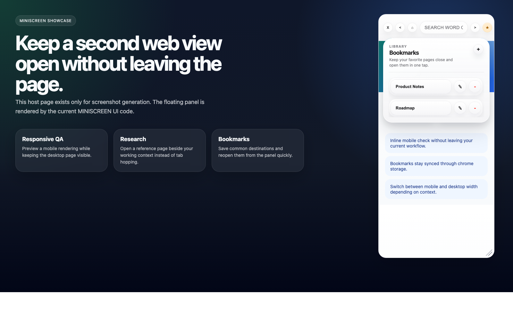
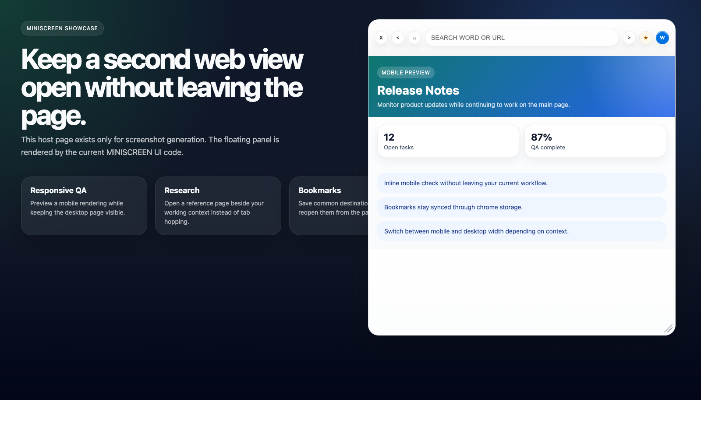

# MINISCREEN

MINISCREEN은 현재 보고 있는 웹페이지 위에 작은 보조 브라우저 화면을 띄우는 Chrome 확장 프로그램입니다. 메인 탭을 벗어나지 않고 모바일 화면을 확인하거나, 참고 페이지를 옆에 띄워 두고 비교 작업을 할 수 있도록 설계되어 있습니다.

## 프로젝트 한눈에 보기

- 현재 탭 위에 `iframe` 기반 미니 브라우저를 오버레이로 표시
- `mobile view`와 `desktop view` 전환 지원
- 검색어와 URL을 자동 판별하는 주소 입력창 제공
- 뒤로가기, 홈 이동, 북마크 패널, 북마크 추가/수정/삭제 지원
- 드래그 이동, 리사이즈, 전체화면 토글 지원
- 홈 URL, 북마크, 뷰 모드를 `chrome.storage.sync`에 저장
- 프레임 내부 이동을 추적해 주소와 제목을 최대한 동기화

## 화면 예시

### 모바일 뷰 + 북마크 패널



### 데스크톱 뷰



## 이런 때 유용합니다

- 반응형 검수 중 모바일 레이아웃을 빠르게 확인할 때
- 메인 작업 페이지를 유지한 채 문서, 검색 결과, 참고 사이트를 함께 볼 때
- 쇼핑몰, 랜딩 페이지, 블로그를 작은 보조 화면으로 열어 비교할 때

## 설치 방법

### Chrome Web Store에서 설치

1. [Chrome Web Store](https://chromewebstore.google.com/detail/hkbkhopmbecilgmfacgbihohlfhhbpin)로 이동합니다.
2. `Chrome에 추가`를 클릭합니다.

### 압축 해제된 확장 프로그램으로 설치

빌드 과정은 없습니다. 저장소를 그대로 로드하면 됩니다.

1. 이 저장소를 클론하거나 다운로드합니다.
2. Chrome에서 `chrome://extensions/`로 이동합니다.
3. 우측 상단 `개발자 모드`를 활성화합니다.
4. `압축해제된 확장 프로그램을 로드합니다`를 클릭합니다.
5. 이 프로젝트 폴더를 선택합니다.

## 사용 방법

### 1. 실행

브라우저 툴바의 MINISCREEN 아이콘을 클릭하면 현재 페이지 위에 미니 화면이 열립니다.

- 기본 홈 URL은 `https://www.google.com/`입니다.
- 저장된 홈 URL이 있으면 해당 주소로 시작합니다.
- 이미 열려 있으면 중복으로 생성하지 않습니다.

### 2. 주소 입력창

- `.`이 없는 입력값은 검색어로 간주해 DuckDuckGo 검색을 실행합니다.
- `.`이 포함된 입력값은 URL로 간주합니다.
- `http://`, `https://`가 없으면 `https://`를 자동으로 붙입니다.
- 빈 값으로 이동하면 저장된 홈 URL로 이동합니다.

### 3. 탐색과 홈 설정

- `<` 버튼: iframe 내부 뒤로가기
- `>` 버튼 또는 `Enter`: 현재 입력값으로 이동
- `⌂` 버튼 클릭: 저장된 홈 URL로 이동
- `⌂` 버튼 우클릭: 현재 URL 또는 입력창 값을 홈 URL로 저장

### 4. 북마크

- `★` 버튼: 북마크 패널 열기/닫기
- `+` 버튼: 현재 페이지를 북마크에 추가
- 동일 URL은 중복 저장하지 않습니다.
- 북마크는 최대 20개까지 유지합니다.
- 북마크 이름 수정과 삭제를 지원합니다.

### 5. 뷰 모드 전환

우측 상단 `M / W` 버튼으로 뷰 모드를 전환할 수 있습니다.

- `M`: 모바일 뷰
- `W`: 데스크톱 웹 뷰

모바일 뷰에서는 서브프레임 요청에 모바일 User-Agent를 적용합니다. 선택한 모드는 저장되며 다음 실행 때 복원됩니다.

### 6. 이동과 크기 조절

- 헤더 또는 주소 입력창을 드래그해 위치를 이동할 수 있습니다.
- 우하단 리사이즈 핸들로 크기를 조절할 수 있습니다.
- 주소 입력창 더블클릭으로 전체화면 토글이 가능합니다.
- 오버레이가 화면 밖으로 벗어나지 않도록 viewport 기준으로 보정합니다.
- 브라우저 크기 변경 시 위치를 기본값으로 재정렬합니다.

## 프로젝트 구조

```text
MINISCREEN/
├── manifest.json                # 확장 프로그램 설정과 권한
├── src/
│   ├── background/
│   │   ├── index.js             # 서비스 워커 진입점, content 스크립트 주입
│   │   ├── messages.js          # runtime 메시지 처리
│   │   └── rules.js             # 뷰 모드별 동적 네트워크 규칙
│   ├── content/
│   │   ├── app.js               # 오버레이 초기화와 이벤트 연결
│   │   ├── bookmarks.js         # 북마크 상태와 렌더링
│   │   ├── constants.js         # content 레이어 상수
│   │   ├── dom.js               # 오버레이 템플릿과 DOM 참조 수집
│   │   ├── layout.js            # 드래그, 리사이즈, viewport 보정
│   │   ├── runtime.js           # background 메시지 호출 래퍼
│   │   ├── services.js          # 홈/북마크/뷰 모드 업무 로직
│   │   ├── storage.js           # chrome.storage 접근 래퍼
│   │   ├── styles.css           # 오버레이 UI 스타일
│   │   └── utils.js             # URL 정규화와 제목 유틸
│   └── frame-tracker/
│       └── index.js             # iframe 내부 주소 변경 추적 및 링크 이동 보정
├── docs/
│   └── images/
└── icon*.png                    # 확장 프로그램 아이콘
```

## 동작 방식

### `src/background`

- 확장 아이콘 클릭 시 현재 탭에 content 레이어 파일을 주입합니다.
- content script에서 보낸 runtime 메시지를 처리합니다.
- `declarativeNetRequest` 동적 규칙을 생성하고 갱신합니다.
- 모바일 뷰일 때 서브프레임 요청에 모바일 User-Agent를 적용합니다.

### `src/content`

- 오버레이 UI를 생성하고 이벤트를 연결합니다.
- 북마크 목록 렌더링, 추가, 수정, 삭제를 담당합니다.
- 드래그 이동, 리사이즈, viewport 보정을 처리합니다.
- 홈 URL, 북마크, 뷰 모드와 관련된 업무 로직을 캡슐화합니다.

### `src/frame-tracker`

- iframe 내부에서 실행되는 보조 스크립트입니다.
- `load`, `pageshow`, `hashchange`, `history.pushState`, `history.replaceState`를 감지합니다.
- 현재 프레임 URL과 title을 상위 창에 `postMessage`로 전달합니다.
- 새 탭이나 팝업으로 열릴 동작을 가능한 범위에서 iframe 내부 탐색으로 전환합니다.

## 권한과 이유

`manifest.json`에는 아래 권한이 포함되어 있습니다.

- `scripting`: 현재 탭에 `src/content/*` 스크립트를 주입하기 위해 사용
- `storage`: 홈 URL, 북마크, 뷰 모드를 저장하기 위해 사용
- `declarativeNetRequest`: 프레임 차단 헤더 제거와 User-Agent 변경에 사용
- `host_permissions: <all_urls>`: 다양한 사이트를 미니 화면에서 열기 위해 필요

## 제약 사항

MINISCREEN은 "가능한 한 많은 사이트를 미니 프레임으로 열기"에 초점을 둔 확장 프로그램입니다. 이 특성 때문에 아래와 같은 제한이 있습니다.

- 일부 사이트는 여전히 iframe 로딩을 차단할 수 있습니다.
- `Content-Security-Policy`, `X-Frame-Options` 제거가 항상 성공을 보장하지는 않습니다.
- 사이트별 로그인 정책, 쿠키 정책, 스크립트 정책에 따라 동작이 달라질 수 있습니다.
- 모바일 User-Agent 강제 적용은 일부 사이트에서 예기치 않은 UI 차이를 만들 수 있습니다.
- Chrome 확장 프로그램 정책 또는 브라우저 보안 정책 변경의 영향을 받을 수 있습니다.

## 개발 메모

- 별도 번들러나 패키지 매니저 없이 동작하는 순수 JavaScript 기반 프로젝트입니다.
- 소스 수정 후 `chrome://extensions/`에서 확장 프로그램을 새로고침하면 변경 사항을 확인할 수 있습니다.
- 현재 저장소에는 테스트, 린트, 빌드 스크립트가 포함되어 있지 않습니다.

## 개선 아이디어

- 홈 URL 설정 UI 추가
- 북마크 정렬, 폴더, 검색 지원
- 위치와 크기 상태 영속화
- 사이트별 뷰 모드 기억
- 키보드 단축키와 접근성 개선

## 라이선스

저장소에 별도 `LICENSE` 파일이 없다면 기본적으로 명시적 사용 허가가 없는 상태입니다. 공개 배포 목적이라면 `LICENSE` 파일을 추가하는 것을 권장합니다.
